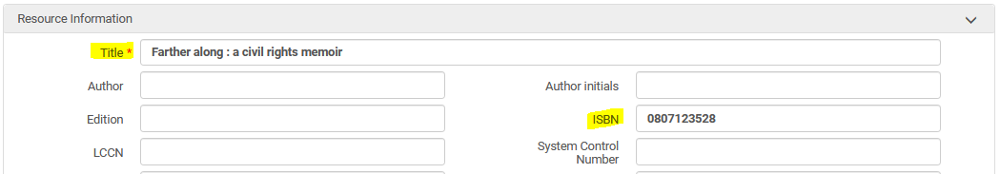

# Receiving Non-Purchased Items for Stacks

## Alma Steps 

* Choose Resources>Add Physical Item\
  
* Choose holdings type “new” and click “Choose”

* This form creates a brief bibliographic record. Only the following fields are necessary in the Resource Information section:
  * Title: Enter the title of the resource. This can be an abbreviated title, and can be in roman or non-roman script.
  * ISBN: This is helpful if one exists on the resource.

* Scroll down, select the item’s location and add the item barcode.

* Click “Save” to create the bibliographic, holding, and item record.
* Go to “Acquisitions>Scan in items” or “Fulfillment>Scan in items”. Scan the item barcode to place the item in “Cataloging” status.

## Physical Handling

* Barcode the item
* Place the item on the “Cataloging” shelf in 610.
