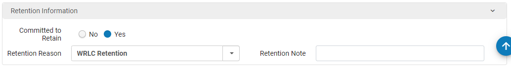

# Damaged Items (Content Management Steps)


This is part of the overall [Damaged Items workflow](../reference/workflow-overviews/damaged-items.md)


<figure><figcaption>
Decision tree for determining damaged item status
</figcaption></figure>

## Content Management manually checks items to determine what status to assign.

### Step 1: Retention Check

Open the item record. On the item’s barcode page, check the “Retention Information” section to see if the Committed to Retain is “Yes”.

If Committed to Retain is Yes:

* If there are missing pages, severe physical/water damage, extensive handwriting/highlighting, or if it is too brittle/fragile ──> Scan into "Damaged - Replace"
* If it is physically sound enough for the bindery──> Scan into "Damaged - Rebind"

If Committed to Retain is No or blank, proceed to Step 2.

### Step 2: Multivolume Check

Check the item description field to determine whether the item is part of a multivolume set.

* If the description field contains volume information ──> Scan into "Damaged - CDL Review"
* If the description field is blank, proceed to Step 3.

### Step 3: Inventory Check for Additional Copies in IZ

Check for other copies in the Institution Zone

* If another copy exists in the IZ and is available or on loan ──> Scan into "Withdraw"
* If no other copy is available in the IZ (no copies exist or other copies are lost/missing), proceed to Step 4.

### Step 4: Inventory Check for Additional Copies in NZ

.png>)

Check for other copies in the Network Zone

*   If an NZ copy is "Available" ──> Scan into "Withdraw" 

    
*   If an NZ copy exists but is "Unavailable", click into the item details 

    

    

    * If status is On Loan ──> Scan into "Withdraw"
    * If status is something else ──> Scan into "Damaged - CDL Review"
* If no NZ copy exists ──> Scan into "Damaged - CDL Review"

## Damaged Item Evaluation Tool

Optionally, you can use the [Damaged Item Evaluation tool](https://script.google.com/a/macros/email.gwu.edu/s/AKfycbzR9WAKM6omvsaH9L35AH71eR59zwjnlLXwub1j9Vq8p5dZsOeQNccDAleOQ8N6-yekSg/exec) to automatically check most of the above.

