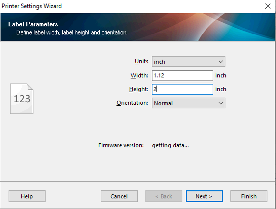
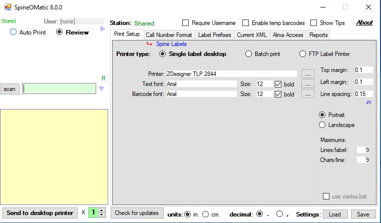
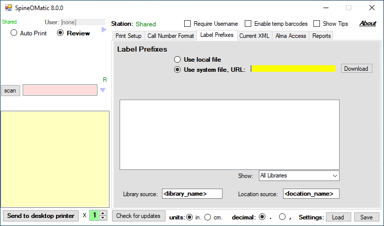

# Label Printing

We use the SpineOMatic label printing software with our label printers. A workstation with label printer is set up in Gelman 103.

### Printer Setup

Set the printing height in the Zebra Setup Utilities application. Click "Configure Printer Settings", and in the Label Parameters window set the height to "2". Click "Next >" through the rest of the steps keeping the default values.

<figure><figcaption></figcaption></figure>

### SpineOMatic Setup

The standard print setup is shown below. For DVDs, change the font size to 10, but for everything else the font size should be 12. Increase the maximum lines/label from the default to 9.

<figure><figcaption></figcaption></figure>

In the Label Prefixes tab, select "Use system file" and use the following URL:


```
https://github.com/gwu-libraries/gwlai-spineomatic-label-prefixes/blob/main/aboveLabel.txt?raw=true
```


This will import the list of locations and prefixes used in LAI.

The file is located in the [LAI github account](https://github.com/gwu-libraries/gwlai-spineomatic-label-prefixes), and modifications can be made there or requested from [bright@gwu.edu](mailto:bright@gwu.edu)

<figure><figcaption></figcaption></figure>
