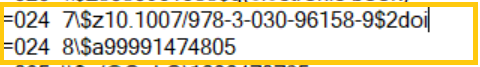
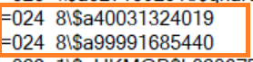

# WorldShare Management Services

### Downloading

* Login to [WMS](https://gw.share.worldcat.org/wms/cmnd/), and navigate to the "Downloads" tab.&#x20;
* Download batch MARC records: Approval, FIRM or Horrworth or AAePortal (new or update) MARC records.&#x20;
* Convert the\*.mrc file to \*.mrk file and apply MarcEdit task to each individual \*.mrk file

### Record cleanup and preparation for Alma

#### ACQ Approvals, Firm, and Horrworth

In MarcEdit run the following tasks: ([.task file](https://gwu0.sharepoint.com/:u:/s/20180727030128000/EYNZfQAwDMlOlDrJ6Ye0NmwBReYPwyx6ZhIpVcfa6ujQvA))

* Delete 961 field
* Delete 938 field
* buildnewfield :=961  \\\\$b{960$b}$d{960$d}$f{960$f}$g{960$g}$m{852$b}$n{852$c}
* Delete 960 field
* Delete 852 field
* Copy 961 field to 960 field - delete source field
* Copy 960 $dGHORRWORTH field to 971 field
* Bulidnewfield : =971 2$a{971$d} - replace existing field
* Editfield 971 $aGHORRWORTH - replace $aJohn Horrworth Children's Literature Collection. $9local
* SUBFIELD\_EDIT 949 $9 LOCAL
* SUBFIELD\_EDIT 960 $9 LOCAL
* REMOVEBLANKLINES

After finish running the task, save the \*.mrk file to a new name in this pattern: yyymmdd\_name(X)\_ready. Examples: 20220910\_APPR(12)\_ready.mrk

Compile \*.mrk file into \*.mrc file and save the same name as above \*.mrk file.

&#x20;


Firm order records: sometimes some records contain two different 024 number that will affect the import process. In this case, remove one of the 024 field based on other records’ vendor reference number pattern (same vendor), usually keep the 024 field beginning with 9999…



#### A\&A ePortal

In MarcEdit, run the following tasks: ([.task file for download](https://gwu0.sharepoint.com/:u:/s/20180727030128000/Eb6GOPqWJw1HroZAQZiqOJEBVvr1FrYlMyPuJxVfw0ZEPA))

* Delete the 1st part of the URL : http://proxygw.wrlc.org/login?url= in the subfield $u of the 856 field
* Delete 911 field
* Delete 994 field
* Replace "=856 40" with "=957 40"
* Add $9LOCAL to 957 field

After finish running the task, save the \*.mrk file to a new name in this pattern: yyymmdd\_name(X)\_ready. Examples: 20220916\_A\&AePortal(34)\_new\_ready.mrk or 20220916\_ A\&AePortal(25)\_update\_ready.mrk

Compile \*.mrk file into \*.mrc file and save the same name as above \*.mrk file.

### Importing into Alma

Import \*.mrc records into Alma by individual Alma Import Profile

* &#x20;For Approval or Horrworth records:  Use “OCLCAPPROVAL (manual)” import profile.
* For Firm Order records: Use “OCLC Firms” import profile.
* For AAePortal records: Use “A\&A ePortal” import profile. \

Check Alma Import Job report to make sure the total number records /items loaded are matched.

<figure><figcaption></figcaption></figure>

Update on RDG's [Alma Ongoing Record Loads tracking sheet](https://gwu0.sharepoint.com/:x:/r/sites/20180727030128000/Collaboration%20Items/Admin/Alma%20Ongoing%20Record%20Loads.xlsx?d=wade799fa6af14b9aa212b8853cc91183\&csf=1\&web=1\&e=5bgkww).
