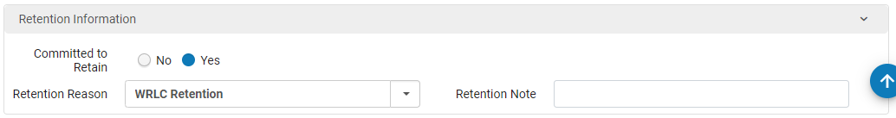

# Damaged Items


This is part of the overall [Damaged Items workflow](../../reference/workflow-overviews/damaged-items.md)


## Item record work and flag 

### Check retention status

Open the item record. On the “Notes” tab, check the “Internal Note 2” field. If the field is blank or “DUPLICATE”, it is not a retention or permanent copy. The retention designation is now officially recorded in the “Internal Note 2” field, not the location. While many items may still show the retention designation in the location, that can no longer be relied on as accurate, and a future project will be consolidating location codes so that the retention status will only be shown in the internal note.

<figure><figcaption>
This denotes that GW is committed to retain this item.
</figcaption></figure>

### Fill out blue flag

* If the item “committed to retain” is “Yes”, check “Retention or Permanent”, otherwise, check “Non-retention”.

<figure><figcaption>
The damaged item routing slip to be filled out with every damaged item sent to Content Management
</figcaption></figure>

## Content Management shelves

### Place on “Incoming” shelves in Content Management

Bring the damaged items to the “Incoming” section of shelves in the Content Management workroom, Gelman 103.

* Place all damaged retention or permanent books on the “Incoming - Damaged Retention” shelf.
* Place all damaged non-retention books on the “Incoming - Damaged Non-retention” shelf.

If there are more damaged books than can fit on these shelves, please place them on a book truck with a clear note that they are incoming damaged books.

