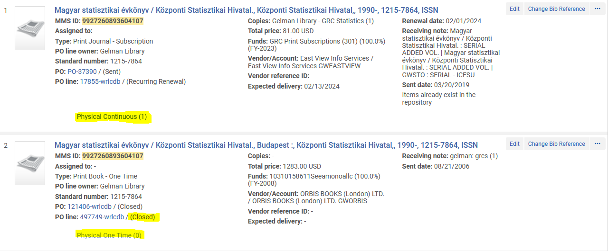
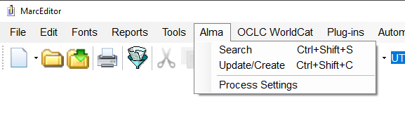

# \*MarcEdit

## Alma Integration

MarcEdit and Alma Integration (20180716rev)

Set up ILS integration to Alma. Click on <  (1).png>)> on lower right corner of main menu.

&#x20;

Select \<ILS Integration> to begin setting access to Alma

 (1).png>)

&#x20;

Set up access to Alma as default:

&#x20;

Host name: [https://api-na.hosted.exlibrisgroup.com](https://api-na.hosted.exlibrisgroup.com)

Password: <\<PLEASE SEE MATTHEW FOR PASSWORD>>

&#x20;.png>)

&#x20; (1).png>)\

Edit setting of Z39.50:

The character set in Alma is UTF-8

&#x20;

(Voyager setting was MARC-8)

&#x20; (1).png>)

&#x20;

Now that the ME to Alma integration has been established, the \<Alma> tab on MarcEditor tool is active and ready for searching, update/create MARC records in Alma via Z39.50.

The \<Search> function utilizes Z39.50 Bib1 attribute document for the specific indexes. Here are the basic search indexes available in Marcedit version 7.

&#x20;

Consult the Bulk\* search documents on best strategies on batch searches on other fields, especially \<Raw (Adv.)> search.

&#x20;

Pre-process of MARC data is available under \<Process Settings>.  This function calls the Tasks that have already been established.

To create Tasks anew, from \<Tools>, select \<Manage Tasks>--\<Create New Task List>--enter name of this new task list.

An example of various tasks added to a Task list below.

&#x20;

Related documents:

Alma APIs [https://developers.exlibrisgroup.com/alma/apis/bibs](https://developers.exlibrisgroup.com/alma/apis/bibs)

MarcEdit takes advantage of:

&#x20;   /almaws/v1/bibs

&#x20;       Create Record

&#x20;       Update Record

&#x20;       Retrieve Holdings List

&#x20;       Create Holdings List

&#x20;       Update Holdings list

## Resources

Management, Content Access. n.d. “LibGuides: MarcEdit: MarcEdit Online Resources.” Accessed December 7, 2021. [https://guides.library.illinois.edu/c.php?g=463460\&p=3168006](https://guides.library.illinois.edu/c.php?g=463460\&p=3168006).

“MARC\_Edit\_session\_01.Pdf.” n.d. Accessed December 7, 2021. [https://cdn.ymaws.com/www.oklibs.org/resource/resmgr/ola2017/Handouts/MARC\_Edit\_session\_01.pdf](https://cdn.ymaws.com/www.oklibs.org/resource/resmgr/ola2017/Handouts/MARC\_Edit\_session\_01.pdf).

“Reese - Learning MarcEdit.Pdf.” n.d. Accessed December 7, 2021. [https://www.senylrc.org/sites/senylrc.org/files/marcedit\_presentation\_oct2019.pdf](https://www.senylrc.org/sites/senylrc.org/files/marcedit\_presentation\_oct2019.pdf).

Reese, Terry, and Wendy Robertson. 2018. “A Beginners Guide to MarcEdit and Beyond the Editor: Advanced Tools and Techniques for Working with Metadata.” _The Serials Librarian_ 74 (1–4): 3–8. [https://doi.org/10.1080/0361526X.2018.1439247](https://doi.org/10.1080/0361526X.2018.1439247).

reeset. n.d. “Current News.” Text. MarcEdit Development. World. Accessed December 7, 2021. [https://marcedit.reeset.net/](https://marcedit.reeset.net).
